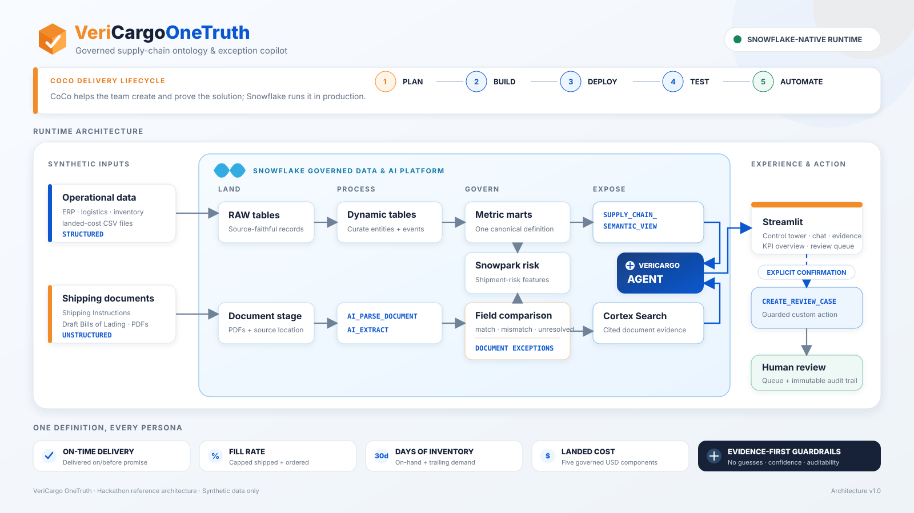

# VeriCargo OneTruth

**A Snowflake-native pre-issuance document gate and governed supply-chain exception copilot.**

> One shipment. Two destinations. One governed truth.

VeriCargo OneTruth addresses a common logistics failure: operational records, Shipping
Instructions (SI), and Draft Bills of Lading (Draft BL) can disagree, while different teams
also calculate delivery performance differently. The result is manual reconciliation,
document amendments, delayed action, and no reliable audit trail.

OneTruth connects operational and documentary evidence through one governed ontology. It
detects contradictions, preserves both source values, explains the business context, and
allows a human—not the conversational model—to confirm an auditable review action.

**Hackathon challenge:** Supply Chain Ontology and Governed Conversational Analytics

## Judge walkthrough

Use `SHP-1002` for the primary four-minute demonstration.

| Step | Where | What it proves |
|---|---|---|
| 1 | Control Tower | `SHP-1002` is high-risk with two governed findings. |
| 2 | Shipment Intelligence | The Decision Brief returns **HOLD · correction required**. |
| 3 | Document Evidence | SI destination `VNSGN` conflicts with Draft BL `THLCH`; weight is `8000` versus `7800` kg. |
| 4 | OneTruth Copilot | The Agent explains the delay and mismatch and cites both source filenames. |
| 5 | Human Review | Cancel writes nothing; Confirm creates one case linked to both exceptions. |
| 6 | Governance | Definitions, runtime mode, automation status, and audit history remain visible. |

The full recording sequence and narration are in
[`docs/demo-script.md`](docs/demo-script.md). The submission deck is available as
[`VeriCargo_OneTruth_Prototype_Deck.pdf`](VeriCargo_OneTruth_Prototype_Deck.pdf).

## The decision flow

```text
Operational shipment record ─┐
Shipping Instruction ────────┼─> normalize and compare ─> CLEAR / HOLD / UNRESOLVED
Draft Bill of Lading ────────┘                                │
                                                              v
                                              evidence-backed explanation
                                                              │
                                                              v
                                                human-confirmed review
                                                              │
                                                              v
                                                   append-only audit
```

The model never chooses which conflicting document is "true." OneTruth retains the
contradiction and routes it to controlled resolution.

## Working MVP

- Synthetic but referentially consistent suppliers, parts, plants, customers, orders,
  shipments, ports, events, inventory, cost, SI, and Draft BL data
- Snowflake RAW, CURATED, ANALYTICS, and APP layers
- Dynamic tables plus Snowpark shipment-risk features
- Deterministic normalization and comparison for ports, weights, and container counts
- Governed `MATCH`, `MISMATCH`, `MISSING`, `UNRESOLVED`, and `NOT_APPLICABLE` outcomes
- Four canonical metrics: on-time delivery, fill rate, days of inventory, and USD landed cost
- Native `SUPPLY_CHAIN_SEMANTIC_VIEW` with verified persona questions
- `VERICARGO_AGENT` using Cortex Analyst over governed metrics and structured evidence
- Six connected Streamlit pages sharing one shipment context
- Explicit-confirmation review workflow, duplicate protection, legal transitions, and audit
- Daily exception digest through a Snowflake Task fallback

## Snowflake architecture



The relationship path is:

```text
Supplier → Part → Plant → Order → Shipment → Container / Port → Customer
```

Documents, exceptions, review cases, and audit events attach to the governed shipment
context. Streamlit reads stable `APP.VW_*` contracts rather than joining raw tables or
embedding demonstration values in the interface.

See [`docs/architecture.md`](docs/architecture.md) for the object and interaction flow.

## Governed conversational analytics

Operations, procurement, and planning can phrase the same delivery question differently.
All three verified questions resolve to the same definition and result:

```text
On-time delivery = delivered on or before promise / delivered shipments
Result           = 60.0% (3 on time / 5 delivered)
Grain            = shipment
Window           = all delivered synthetic shipments
```

The Agent is read-only for business mutations. It may explain evidence and propose a
review, but only the Streamlit confirmation boundary calls the mutating procedure.

## CoCo CLI contribution

CoCo is the engineering copilot used across the delivery lifecycle; it is not a runtime
document reader.

| Phase | Demonstrated use |
|---|---|
| Plan | Ontology, metrics, architecture, guardrails, and acceptance tests |
| Develop | SQL/Python review and Korean port-alias parity repair |
| Execute | Snowflake objects, semantic layer, Agent, Task, and Streamlit deployment |
| Test and repair | Failed-then-fixed evidence plus local and Snowflake regression checks |
| Reuse | Supply-chain governance skill and daily exception-digest automation prompt |

Real session IDs, query IDs, failures, fixes, and runtime boundaries are retained in
[`COCO_USAGE.md`](COCO_USAGE.md). The approved plan and reusable skill are included under
`.cortex/plans/` and `.snowflake/cortex/skills/`.

## Transparent event-account boundary

The organizer-provided Snowflake trial rejects `AI_PARSE_DOCUMENT`, `AI_EXTRACT`, and the
embedding model required by Cortex Search. The submitted runtime therefore uses:

- disclosed deterministic extraction fixtures generated from the same team-authored PDFs;
- the same downstream normalization, comparison, exception, risk, and audit contracts;
- Cortex Analyst over governed structured evidence and source filenames;
- an optional native Document AI and Cortex Search path retained in source for entitled
  Snowflake accounts.

The judge-facing application does **not** claim to analyze arbitrary newly uploaded PDFs.
Unknown or failed evidence is never converted into an invented fact. Active processing and
retrieval modes are visible on the Governance page. Details are documented in
[`docs/known_limitations.md`](docs/known_limitations.md).

## Validation status

- **41/41** local unit, contract, UI, and Streamlit smoke tests passing
- **28/28** retained Snowflake validation checks passing
- Three persona questions return the same governed OTD result
- Match, mismatch, missing, unreadable, ambiguous, and low-confidence scenarios covered
- Unknown shipment, unconfirmed action, duplicate active case, and illegal transition blocked
- Repository secret scan passes; only synthetic business data is submitted

Run the local suite:

```powershell
python .\scripts\generate_data.py
python -m unittest discover -s tests -v
powershell.exe -NoProfile -ExecutionPolicy Bypass -File .\scripts\scan_secrets.ps1
```

## Deployment

Prerequisites are Python 3.11+, Snowflake CLI, CoCo CLI, and a named Snowflake connection
with the required object-creation privileges. Never store credentials in this repository.

Deploy the core event-account-compatible solution:

```powershell
.\scripts\deploy.ps1 -Connection YOUR_HACKATHON_CONNECTION
```

For external-browser OAuth environments that cannot cache credentials between Snow CLI
processes:

```powershell
python .\scripts\deploy_live.py --connection YOUR_HACKATHON_CONNECTION
```

The deployment generates fixtures, creates Snowflake objects, stages CSV/PDF data, runs
processing and validation, and deploys Streamlit. The optional entitled-account retrieval
path is in
[`snowflake/optional/06_search_and_agent_entitled.sql`](snowflake/optional/06_search_and_agent_entitled.sql).

## Repository map

```text
app/                         Six-page Streamlit decision experience
automations/                 CoCo automation prompt
data/generated/              Team-authored synthetic CSV/PDF fixtures
docs/                        Architecture, demo, access, tests, and limitations
scripts/                     Fixture generation, deployment, and secret scan
snowflake/                   Ordered Snowflake SQL and optional entitled path
src/vericargo_onetruth/      Deterministic domain logic
tests/                       Local acceptance and UI smoke tests
.cortex/plans/               Approved CoCo plan
.snowflake/cortex/skills/    Reusable supply-chain governance skill
```

## Provenance and access

All submitted business data and documents are deterministic, team-authored synthetic
fixtures. Dataset details are in [`DATASETS.md`](DATASETS.md).

The earlier VeriCargo Chrome extension is disclosed team-owned background IP and is not a
runtime dependency or source of truth for this submission. See
[`BACKGROUND_IP.md`](BACKGROUND_IP.md).

Credential-free judge navigation instructions are in
[`docs/judge-access.md`](docs/judge-access.md).
