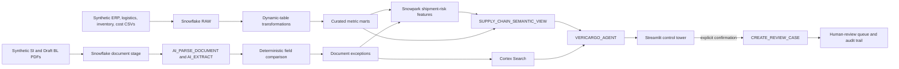

# Architecture and governed definitions

## Canonical metrics

- **On-time delivery rate:** on-time delivered shipments / delivered shipments.
- **Fill rate:** sum of the lesser of shipped and ordered quantity / ordered quantity.
- **Days of inventory:** latest on-hand quantity / trailing-30-day average daily shipped
  quantity. It is null when trailing demand is zero.
- **Landed cost:** product + freight + duty + insurance + handling cost in synthetic USD.

Metric definitions live once in the curated marts and native semantic view. Persona wording
must never change the definition, denominator, grain, or time filter.

## Guardrails

- Document parsing or extraction errors create evidence-backed review exceptions.
- Missing values remain unresolved; they are never filled with model guesses.
- Review creation requires an explicit boolean confirmation and a known shipment ID.
- The action procedure validates severity, limits free-text length, and writes actor/time.
- Only synthetic data is used in the repository and demonstration.

